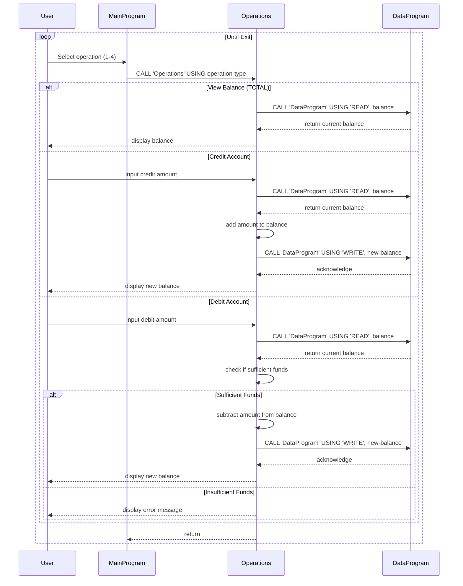

# Documentation

This document provides an overview of the COBOL application data flow.

## Sequence Diagram

```mermaid
sequenceDiagram
    participant User
    participant MainProgram
    participant Operations
    participant DataProgram

    loop Until Exit
        User->>MainProgram: Select operation (1-4)
        MainProgram->>Operations: CALL 'Operations' USING operation-type

        alt View Balance (TOTAL)
            Operations->>DataProgram: CALL 'DataProgram' USING 'READ', balance
            DataProgram-->>Operations: return current balance
            Operations-->>User: display balance
        else Credit Account
            User->>Operations: input credit amount
            Operations->>DataProgram: CALL 'DataProgram' USING 'READ', balance
            DataProgram-->>Operations: return current balance
            Operations->>Operations: add amount to balance
            Operations->>DataProgram: CALL 'DataProgram' USING 'WRITE', new-balance
            DataProgram-->>Operations: acknowledge
            Operations-->>User: display new balance
        else Debit Account
            User->>Operations: input debit amount
            Operations->>DataProgram: CALL 'DataProgram' USING 'READ', balance
            DataProgram-->>Operations: return current balance
            Operations->>Operations: check if sufficient funds
            alt Sufficient Funds
                Operations->>Operations: subtract amount from balance
                Operations->>DataProgram: CALL 'DataProgram' USING 'WRITE', new-balance
                DataProgram-->>Operations: acknowledge
                Operations-->>User: display new balance
            else Insufficient Funds
                Operations-->>User: display error message
            end
        end

        Operations-->>MainProgram: return
    end
```